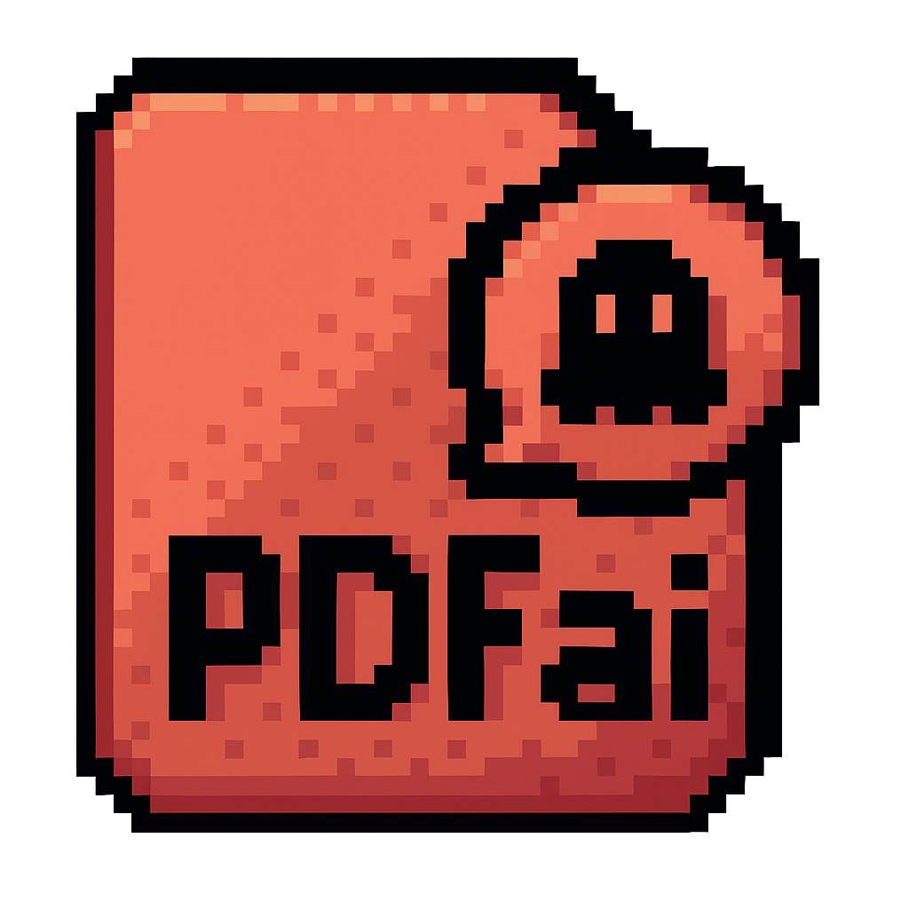

<p align="center">
  
</p>

<h1 align="center">PDFai</h1>

<p align="center">
  <strong>Chatea con tus documentos PDF utilizando el poder de la IA de Gemini.</strong>
</p>

<p align="center">
  
  
  <a href="https://github.com/cCornejoR/PDFai/graphs/contributors" alt="Contributors">
    
  </a>
</p>

---

## 🚀 Introducción

**PDFai** es una aplicación de escritorio multiplataforma construida con Electron y React que te permite interactuar con tus documentos PDF de una manera completamente nueva. Sube tus archivos, organízalos en carpetas y haz preguntas directamente a tus documentos gracias a la integración con la API de Gemini de Google.

<p align="center">
  
</p>

## ✨ Características Principales

- **💬 Chat Interactivo con IA**: Haz preguntas en lenguaje natural sobre el contenido de tus PDFs.
- **📂 Organización de Archivos**: Gestiona tus documentos con un sistema de arrastrar y soltar para archivos y carpetas.
- **👁️ Visualizador de PDF Integrado**: Lee tus documentos directamente en la aplicación con un visor de PDF completo.
- **🧠 RAG Avanzado**: Utiliza un sistema de Retrieval-Augmented Generation para obtener respuestas precisas y contextualizadas.
- **🔒 Gestión Segura de API Key**: Almacena tu API Key de Gemini de forma segura en tu equipo.
- **🎨 Interfaz Moderna**: Una interfaz de usuario limpia y moderna construida con React y Tailwind CSS.

## 🎬 Demostración en Video

Haz clic en las imágenes para ver los videos de demostración de las funcionalidades clave de PDFai.

<table width="100%">
  <tr>
    <td align="center">
      <a href="./public/videos/V1.mp4" title="Click to watch: Feature 1">
        
      </a>
      <br>
      <strong>Carga y Visualización</strong>
    </td>
    <td align="center">
      <a href="./public/videos/V2.mp4" title="Click to watch: Feature 2">
        
      </a>
      <br>
      <strong>Chat con Documentos</strong>
    </td>
  </tr>
  <tr>
    <td align="center">
      <a href="./public/videos/V3.mp4" title="Click to watch: Feature 3">
        
      </a>
      <br>
      <strong>Organización de Archivos</strong>
    </td>
    <td align="center">
      <a href="./public/videos/V4.mp4" title="Click to watch: Feature 4">
        
      </a>
      <br>
      <strong>Gestión de API Key</strong>
    </td>
  </tr>
</table>

## 🛠️ Tecnologías Utilizadas

- **Framework**: Electron, React
- **Lenguaje**: TypeScript
- **Estilos**: Tailwind CSS
- **IA Generativa**: Google Gemini
- **Gestión de Archivos**: dnd-kit
- **Visualización de PDF**: react-pdf-viewer

## 🚀 Cómo Empezar

Sigue estos pasos para ejecutar el proyecto en tu máquina local.

1.  **Clona el repositorio:**
    ```bash
    git clone https://github.com/cCornejoR/PDFai.git
    ```
2.  **Navega al directorio del proyecto:**
    ```bash
    cd PDFai
    ```
3.  **Instala las dependencias:**
    ```bash
    npm install
    ```
4.  **Inicia la aplicación en modo de desarrollo:**
    ```bash
    npm start
    ```

## 🧹 Linting del Código

Para mantener un estilo de código consistente se utiliza **ESLint**. Primero instala las dependencias:

```bash
npm install
```

Luego ejecuta el lint:

```bash
npm run lint
```

ESLint usa la configuración plana definida en `eslint.config.js`.

## 🤝 Contribuciones

¡Las contribuciones son bienvenidas! Si deseas contribuir, por favor revisa nuestra guía de commits para mantener un historial limpio y consistente.

- **[Guía de Commits](./COMMIT_GUIDELINES.md)**

## 📄 Licencia

Este proyecto está bajo la Licencia MIT. Consulta el archivo `LICENSE` para más detalles.

---

<p align="center">
  Hecho con ❤️ por el equipo de PDFai
</p>
